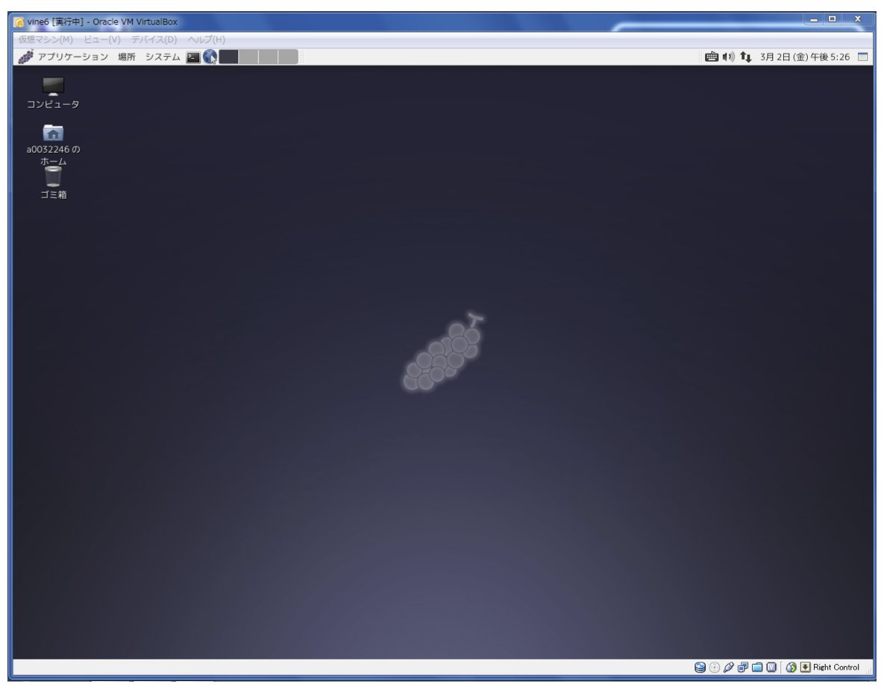

<<<<<<< HEAD
====
ファイルシステム・オンラインマニュアル
====

=======
================
X Window
================
>>>>>>> 2b831459e24bb99e3ad11ecfc9b85536f9047009

実習内容
================
#. X Window システムの理解
#. ウインドウの操作
#. GNOME 端末の操作

課題
================
他のウインドウで完全に隠されたウインドウを見つけて、最前面に表示させる方法についてレポートにまとめなさい。

実習の手順
<<<<<<< HEAD
====
ここではUNIXシステムにログインし、簡単な命令 (date, cal) を実行した後にログアウトするまでの様子を示します。わからない用語や操作が出てきた時は、後ろの解説を参考にしてください。

情報環境機構教育用コンピュータシステムの端末PC（パーソナルコンピュータ（パソコン））では、仮想OS(Vine Linux 6)を用いてセンターのUNIXシステムにログインして利用することができます。

システムの起動
----
#. 端末PCの **ホスト名** を確認しておいて下さい。
#. 電源を投入して下さい。
#. Windowsにログオンしてください。ログオンの方法は情報環境機構の「利用の手引き」に従ってください。

ログイン
----
#. Linuxというアイコンをダブルクリック(マウスの左ボタンを連続して2回押す)してください。図のようなユーザ認証画面がでてきます。######図######ユーザ認証画面
#. **アカウント名** (ユーザネーム：ユーザID ： ID name)を入力して下さい。途中で間違えたら、 ``バックスペース`` キーで間違えた部分を消去して、入力し直してください。
#. **パスワード** を入力して下さい。パスワードは秘密のコードです。決して他人に教えてはいけません\footnote{パスワードは定期的に変更することをおすすめします（:ref:`passwd` 参照)。}。画面にはアスタリスク記号（＊）が入力した文字数だけ表示されます。途中で間違えたら、``バックスペース`` キーで間違えた部分を消去して、入力し直してください。
#. \keytop{ログオン}ボタンをクリックしてください\footnote{ログインとログオン、ログアウトとログオフは同じ意味と考えて問題ありません。UNIXでは通常システムの利用開始・終了手続きをそれぞれログイン・ログアウトと呼び、Windowsではログオン・ログオフと呼びます。}。
#. ログインに成功すると画面が新しく現れます（ログイン画面）

これで、UNIXシステムが利用できる状態になりました。
画面上ではX window と呼ばれるウィンドウシステムが動いていて、
これを利用することになります。

ログイン後の初期画面

.. _xwindow:

X windowの基本操作
----
:ref:`X window<xwindow>` の操作詳細については次章に述べますが、ここではごく基本的な操作に
ついて述べます。

1.マウスを動かしてみて下さい
画面の中で動いている印をポインタと呼びます。
マウスには、ボタンが２つとホイール（ダイヤル）が１つついています。
これを用いて、ウィンドウの操作やメニューの選択を行います。
ボタンの間のホイールはボタンとして操作することができ，以後これを
３つめの「中央ボタン」として使用します．

2.
ポインタを上部にあるバーに移動させ、「アプリケーション」を選択します。
ポインタを「システムツール」に移動させると図\ref{fig:rootmenu}のようなメニューが現れます。
マウスをドラッグして、「端末」を選択します。ウィンドウが開きます。
ポインタは画面の背景(バックグラウンド：ルートウィンドウ)にいくと``矢印"になり、
ウィンドウの中にあると ``I" になります。
=======
================
解説を参考にしながら実習を進めて下さい。

X Windowの操作
---------------
X Window のデスクトップ環境（GUI, 解説参照）として、現在のシステムではGNOMEと呼ばれるソフトウェアを用いています。GNOMEは多くの機能を持ちますが、ここではごく基本的な機能について説明します。

UNIX の特徴として、種々の設定が容易に変更できることが挙げられます。
X Window に関しても、システムを使いやすくする目的で設定が変更されることが頻繁に起きます。従って、画面表示が説明と多少異なっても気にせず、大づかみに機能を理解するようにして下さい。

**用語の説明**
    最初に、説明で使う言葉の意味を列挙しておきます。

**マウスボタンの操作**
    マウスボタンには以下のように数種類の操作法があります。
        **プッシュ**
            単に押すこと。以下の説明では、「押す」という言葉で表します。
        **リリース**
            単に離すこと。以下の説明では、「離す」という言葉で表します。
        **クリック**
            マウスカーソルを移動させずに同じ位置でボタンを押して離すこと。（Windows で多用する「ダブルクリック」は瞬間的に２回クリックすることです。X Window ではダブルクリックはほとんど使いませんので注意してください。)
        **ドラッグ**
            ボタンを押しながら、マウスを移動させること。

**ウィンドウの部分の名前***
    画面内の各部分は以下のように呼ばれます(図2.1、2.2)。

    .. figure:: chapter2_img/desktop-layout12.png
     :width: 70%
     :align: center

     **図 2.1**: デスクトップの各部分の名前

    .. figure:: chapter2_img/window-layout12.png
     :width: 70%
     :align: center
     
     **図 2.2**: window の各部分の名前

    **メニューバー** : 
        画面最上部の、メニューが配置された部分。

    **ルートウィンドウ** : 
        画面中央部の、全てのウィンドウの背景にあたる部分。

    **タスクバー** : 
        画面最上部の、ウィンドウのアイコン（後述）が表示される部分。

    **ウィンドウ** : 
        個々のクライアントプロセス（解説参照）に対応する描画範囲。通常は長方形。

    **タイトルバー** : 
        ウィンドウの上部にある色のついた部分。

    **アプリケーションボタン** :
        タイトルバー左端の四角い部分。

    **ミニマイズボタン** : 
        タイトルバー右端左部の四角い部分（"−"記号）。

    **マキシマイズボタン** : 
        タイトルバー右端中央の四角い部分（"□"記号）。

    **クローズボタン** : 
        タイトルバー右端右部の四角い部分（"Ｘ"記号）。

    **ボーダ** :
        ウィンドウ四辺の縁。

    **マウスカーソル** : 
        マウスによって画面上で移動するマーク。状況に応じて形が変化する。

    .. figure:: chapter2_img/focus-defocus12.png
     :width: 70%
     :align: center

     **図 2.3**: windowの状態

**状態**
    ウィンドウの状態としては以下の用語を用います。

    **フォーカスされている** :
        そのウィンドウが選択されており、キーボードやマウスからの入力が受け付けられる状態。同時に複数のウィンドウがフォーカスされることはない。ここでの設定では、マウスカーソルがウィンドウ内に入った状態でクリックされたときにフォーカスされ、フォーカスされるとタイトルバーと、ボーダーの色が変化する。

    **最前面に表示** :
        ウィンドウが重なっている場合、他のどのウィンドウによっても隠されていない状態を「最前面に表示されている」と言う。

    **最背面に表示** :
        ウィンドウが重なっている場合、ルートウィンドウ以外の他のどのウィンドウよりも後に表示されている状態を「最背面に表示されている」と言う。

**ウィンドウの基本操作**

  **アイコン化**:
      ウィンドウの表示を消し、代わりとなる小さな絵記号（アイコン）を表示することを指します。
      現在のシステムでは、ウィンドウのアイコンは常にタスクバー内に表示されています(図 2.4)。
      マウスカーソルをミニマイズボタンの上に移動させ、マウスの左ボタンをクリックすると、そのウィンドウが消え、表示はアイコンのみとなります。
      このアイコンは使用していないウィンドウを小さく表示して画面を整理するためのものです。Windows のアイコンは、コマンドやファイルに対応しますが、
      この場合のアイコンは、クライアントプロセスに対応することに注意してください。

    .. figure:: chapter2_img/iconified12.png
     :width: 70%
     :align: center

     **図 2.4**: タスクバー内のアイコン

  **ウィンドウの復元**:
      アイコンの上にマウスカーソルを移動し、左ボタンをクリックすると、アイコンが消え、元のウィンドウが元の位置に現れます。このときのウィンドウは最前面に表示され、他のウィンドウと重なる場合はそれらを隠します。

  **大きさの変更**:
      ボーダの上にマウスカーソルを移動させ、左ボタンでドラッグすると、ウィンドウのサイズが変ります。

  **位置の変更**:
      タイトルバーをマウスの左ボタンでドラッグするとウィンドウを移動することができます。タイトルバー上で左ボタンを押した時点で、そのウィンドウは最前面に表示されます。

  **最前面に表示**:
   最前面に表示されていないウィンドウの上でマウスを左クリックすると、そのウィンドウが最前面に表示され、他のウィンドウを隠します。

**ウィンドウメニューの実行**
  ウィンドウのアプリケーションボタンを押すと、図 2.
  5のようなメニュー画面が表示されます。ウィンドウの最大化、最小化、最前面表示、移動、サイズの変更などは、このメニューを選択して行なうことも出来ます。

    .. figure:: chapter2_img/menu12.png
     :width: 30%
     :align: center

     **図 2.5**: メニューの画面  

**コピー＆ペースト**
    これは、文字列の切り貼りです。例えば、GNOME端末を2つ開いておき、片方の端末で実行したコマンドをもう一方の端末で実行するとき、キーボードから同じコマンドを入力するのが面倒なときなどに使います。

    **コピー**
        コピーしたい文字列の先頭にマウスカーソルを移動させ、左ボタンでドラッグしてコピーしたい位置の最後まで移動して、ボタンを離します。コピーした部分の文字列は白黒が反転して表示されます。ウィンドウの右端まで色の反転が起きた場合には、Enterキーを押したときに入力される「改行文字」もコピーされます。複数行のコピーも可能です。
    
    **ペースト**
        貼り付けたいウィンドウに移動してマウスの中央ボタンを押すと、コピーした内容の貼り付けが行えます。クライアントによって多少は異りますが、GNOME 端末の場合、貼り付けは「キーボードからの入力」と同じに扱われます。したがって、コピーした内容に改行文字が含まれている場合、貼り付けと同時にその内容が実行されてしまいます。

    この機能は、異るクライアント間でも行えることがほとんどですが、漢字などの全角文字の貼り付けが行えないケースもありますので注意して下さい。

X Windowの概要
================
X Window は、現在のコンピュータでは常識となった、GUI(Graphical User Intrface)を実現するためのソフトウエアシステムです。このGUIによって、画面上にあたかも、紙がばらばらと置かれているかのような状態で、紙を読んだり、紙に書いたりといった操作が行え、直感的にも分かりやすい操作が行えます。この紙に相当するのが、ウィンドウであり、複数のウィンドウを操作できるGUIをマルチウィンドウシステムともいいます。

    .. figure:: chapter2_img/Xmech.png
     :width: 30%
     :align: center

     **図 2.6**: X window の構成  

もともと、Unix は文字だけを表示する端末を想定して開発されていたため、マイクロソフトのWindowsのように、オペレーティングシステムそのものの中にマルチウィンドウ機能が組み込まれているわけではなく、X Window はオペレーティングシステムとは独立したソフトウエアとして開発されています。したがって、GUIを削除した状態でも、UNIXはきちんと動作するので、家電製品やロボットなどGUIを必要としない機器への組み込み用オペレーティングシステムとして利用することができます。

    .. figure:: chapter2_img/Xmech2.png
     :width: 50%
     :align: center
>>>>>>> 2b831459e24bb99e3ad11ecfc9b85536f9047009

     **図 2.7**: ネットワークを介したX window のりよう  

また、図に示すようにX Window では表示を受け持つ「サーバ」が、個々のウインドウに対応する「クライアント」と通信を行って表示をするように設計されているため、例えば自分の使っているコンピュータに作図用のプログラムが
無くても、別のコンピュータ上の作図用クライアントを動作させれば、あたかも自分の使っているコンピュータ上で作図プログラムが動いているように使うことができます。このX Windowのサーバは Windows 上で動くものもあり、この機能を使えば Windows から UNIX のクライアントを動かすといったことも実現できます。

<<<<<<< HEAD
5.端末エミュレータ用のウィンドウの終了は、
コマンドモードから「exit」命令を入力する
あるいは
ウィンドウ右上隅の''×''ボタンを左クリックすると
ウィンドウは閉じられます。

UNIXの簡単なコマンドの実行
----

ウィンドウ(GNOME端末)で
簡単なUNIXのコマンドを実行してみましょう。
コマンドを入力した後 ``Return`` キーをタイプします。
``date`` コマンドは今日の日付、時刻を表示します。
UNIX では大文字、小文字が区別されます。::

  [a0032246@vine6 ~]$ date
  2012年  4月 2日 月曜日 10:10:10 JST
  [a0032246@vine6 ~]$ DATE
  DATE: コマンドが見つかりません．
  [a0032246@vine6 ~]$

``cal`` は
カレンダーを表示します。
皆さんの誕生した日は、
何曜日だったか調べてみて下さい。::

  [a0032246@vine6 ~]$ cal
        4月 2012
   日 月 火 水 木 金 土
   1  2  3  4  5  6  7
   8  9 10 11 12 13 14
  15 16 17 18 19 20 21
  22 23 24 25 26 27 28
  29 30

  [a0032246@vine6 ~]$

日付を指定することができます。::

  [a0032246@vine6 ~]$ cal 8 1984
        8月 1984
   日 月 火 水 木 金 土
            1  2  3  4
   5  6  7  8  9 10 11
  12 13 14 15 16 17 18
  19 20 21 22 23 24 25
  26 27 28 29 30 31

  [a0032246@vine6 ~]$

ログアウト
----
\label{sec:logout2}

1.
ポインタを上部にあるバーに移動させ、「システム」を選択します。
「システム」のメニューは図1.5のような内容になっています。

####図####
「システム」のメニュー

2.この状態でマウスの左ボタンを押しながらマウスを下へ動かして
メニューの「シャットダウン」を選択します。

3.今のウィンドウ画面が消えて、しばらくすると、Vine Linux 6が終了しWindows画面に戻ります。

情報環境機構の教育用コンピュータシステム
====

計算機環境の概要
----
情報環境機構の各演習室には、数十台のクライアントと呼ばれる端末ＰＣが設置されています。
クライアントで作業をしようとすれば、管理サーバが運転されている必要があります。

*管理サーバ： ソフトの保存、ファイルシステムの提供などの管理の仕事をする。
*クライアント：利用者が実際に使うマシン。

教育用コンピュータシステムの管理サーバは24時間運転されるのであまり気にする必要はありません。
このような計算機の構成をとる事により、利用者はどの端
末PCからでも自分の作成したファイルを利用できます。

電源の投入
----

クライアントの電源は正面の
四角形
の押しボタンスイッチです。これは電源を入れる時
だけに用います。スイッチのそばには電源ランプがあり、電源が入っていない場合は
橙色に、入っている時は緑色に点灯します。したがって、電源ランプが緑色に点灯し
ている時は、原則として電源スイッチに触らないように注意して下さい。

キーの名前と記号
----

この演習書で ``Control`` とか ``Ctrl`` と説
明しているキーは、``コントロール`` です。``Return`` と説明して
いるキーは、
\parbox[c]{0.6cm}{\scalebox{1.1}{\includegraphics{./EPS/return.eps}}}です。
``Tab`` と説明しているキーは、
\parbox[c]{0.6cm}{\scalebox{1.1}{\includegraphics{./EPS/tab.eps}}}です。
``Escape`` とか ``Esc`` と説明しているキーは、
``エスケープ`` です。

ホスト名
----
各クライアントにはホスト名という名前が付けられています。
クライアントは学内ネットワークによって結びつけられており、
各マシンに異なるホスト名を登録することで管理サーバとクライアント、
あるいはクライアント間の適切な通信を可能にしています。
学内ネットワークは外部のネットワークと接続されており、
適当な手続きによりクライアントと外部との通信も可能となります．

UNIXとは
----
\label{sec:unix}

UNIXはオペレーティングシステム(OS)の一つです。パソコンのWindows もOSの一つで
す。OSの仕事は、たとえば、ファイルやディレクトリの管理やプログラムの起動など、
計算機を利用する時に、必ず必要となる一連の作業を行なう基本的なソフトウェアで
す。

UNIXにはさまざまな種類のものがあり、
システムの管理や、入出力装置の制御の関係に
特色があるようです。
しかし、普通にアプリケーションプログラムを利用する場合には、
あまりそれらの相違を気にする必要はないといえます。
したがって、ある一つのUNIXに慣れれば、
他のUNIXも簡単に利用できます。

UNIXの特徴は、

*ファイルシステム: ファイルとディレクトリの概念。
基本的には3.3.1節の図\ref{fig:file-system}に示すように木構造である。

*マルチタスク: 同時に複数のプロセス
\footnote{
プロセスとは、プログラムを実行する時に、
メモリ上に読み込まれて、CPUが実行できる状態になったデータを指します。
したがって、一つのプログラムで複数のプロセスが存在することがあります。
}
が実行できます。
例えば、計算をさせながら論文を作成することができます。

*マルチユーザ: １台の計算機を同時に複数のユーザで利用することができます。
ファイルやプロセスには持ち主を明確にして管理をしています。

*アプリケーション: フリーソフト(無料で配布されるソフトウェア）が多い
**X-Window System
**Editor(vi, Emacs)
**DTP(\LaTeX, Gnuplot, tgif, idraw...)
**プログラミング(c , c++ , gfortran, g95, .....)
           アプリケーション開発、科学技術計算、.....
**通信、ネットワーク(e-mail, ftp, rlogin, NFS....)
           遠隔ログイン、他の計算機とのファイルの共有、転送、電子メール

UNIXに関する最近の大きな変化として、パソコン上で動作するUNIXの普及が挙げられます。
これは主に、1991年にヘルシンキ大学の大学院生Linus Torvalds氏が開発した UNIX互換
OSの Linux に拠る所が大きく、 Linux とこれに関連するソフトウェア群をまとめたパッケージが
現在では多数配布・販売されています。

パソコン上で動作するUNIXを個人利用する場合、マルチユーザの機能を意識する機会
は少なく、演習でもこの点を考慮する場面は特にありませんが、１つの計算機を多数
のユーザで共用する場合、この機能は大変有効です。マルチユーザ機能の一つの効果
として、利用時のユーザ認証によるファイル管理などの安全性確保が挙げられます。
Windows でも最近のものはユーザ認証の機能を持ちますが、ネットワークなどを介し
て複数のユーザが１つの計算機を同時に利用できる点で、マルチユーザはユーザ認証
よりも上位の機能であることに注意して下さい。

.. _passwd:

アカウント名とパスワード
----

UNIXはマルチユーザOSですので、
マシンを使い始めるときは、
使う人が誰なのか、
使う権利を持っている人なのかどうかを
確認して、セキュリティーを保つ必要があります。

そのために、
各人がアカウント名（ユーザネーム：IDネーム）
をもらい、
パスワード（その本人しか知らない情報）
を登録するのです。

パスワードの管理と変更
----
教育用コンピュータシステムでは現在、WWWにより
ネットワーク経由でのパスワード変更が可能となっています。

センターの該当するページ
（2012年3月現在のURL = \texttt{https://ecs.iimc.kyoto-u.ac.jp/}）
から手続きを行う事が出来ます．

付録 I (パニック脱出法)
====
#. キーボードから入力した文字が画面に表示されない。
    * ``C-q`` を押してみる。
        ``C-`` は ``コントロール`` キーを表す。
        従って、``C-q`` は ``コントロール`` を押しながら
        ``q`` を押すことを示す。

        (UNIXでは ``C-s`` で画面表示が停止する。
        ``C-q`` でこれが解除される。)
    * ``英数`` をタイプして緑色のランプを点灯する。
#. プロンプトなどの表示が行頭から始まらない。
    * ``C-j`` を押してみる。
    * ``test`` を入力し ``C-j`` を押してみる。

    (コマンドの強制終了などで画面に対する設定が異常になった)。
#. キーボードからの入力は画面に表示されるがプロンプトが表示されない。
    * ``C-c`` を押してみる。

    (キーボードの入力を読み取るコマンドが実行されている。
    ``C-c`` はコマンドを強制終了させる命令)
#. プロンプトが表示されない。
  * ``C-c`` を押してみる。

    (コマンドが暴走した[終了しない]ため、
    ``C-c`` でコマンドを強制終了させる)

付録 II (UNIXコマンド 1)
====
``コマンド名`` : 主な機能
   説明

``login`` : セッションの開始
   loginプログラムは、ユーザをシステムにログインする。その主な機能は、パスワードを検証し、必要な課金処理とログイン入力を行い、ユーザに該当する環境を設定し、パスワードファイルで指定されているユーザのコマンド解析プログラムを実行することである。

``date`` : 日付の表示と設定
   現在の日付と時刻の表示を行う。

``cal`` : カレンダの表示
   calは指定した年のカレンダの表示を行う。 ``cal [month] [year]`` のように月を指定すると、その月のカレンダだけを表示する。

``clear`` : 端末装置の画面の消去

``bc`` : 任意精度演算用言語
   bcはC言語に類似した対話形式のプロセサで、任意精度の算術演算を行う。 ``bc [-c][-1][file...]`` のように使う。

``who`` : システム利用者の表示
   whoは、現在システムを利用しているユーザのユーザ名、端末回線、ログイン時刻、最後の入力からの経過時間、コマンドインタプリタ(シェル)のプロセスIDを表示する。

各々のコマンドの詳しい説明は、
マニュアルコマンド ``man`` で参照して下さい。
=======
では、Xサーバが表示している個々のウィンドウを、移動させたり、手前に持ってきたり、サイズを変えたり、という操作はどのプロセスが行っているのでしょうか?これは、ウィンドウマネージャという特別なクライアントが、マウスの移動や、ボタンのクリックなどの「イベント」を見張っており、それに応じて個々のウィンドウの状態を変えているのです。

このように、オペレーティングシステムと独立に設計されたX Window システムは、ネットワークを介した利用ができることや、ウィンドウマネージャを入
れ換えたり、その動作を自分の好みに合わせて使うなどのことができるようになっており、非常に自由度が高いマルチウィンドウ環境を提供してくれます。

>>>>>>> 2b831459e24bb99e3ad11ecfc9b85536f9047009
