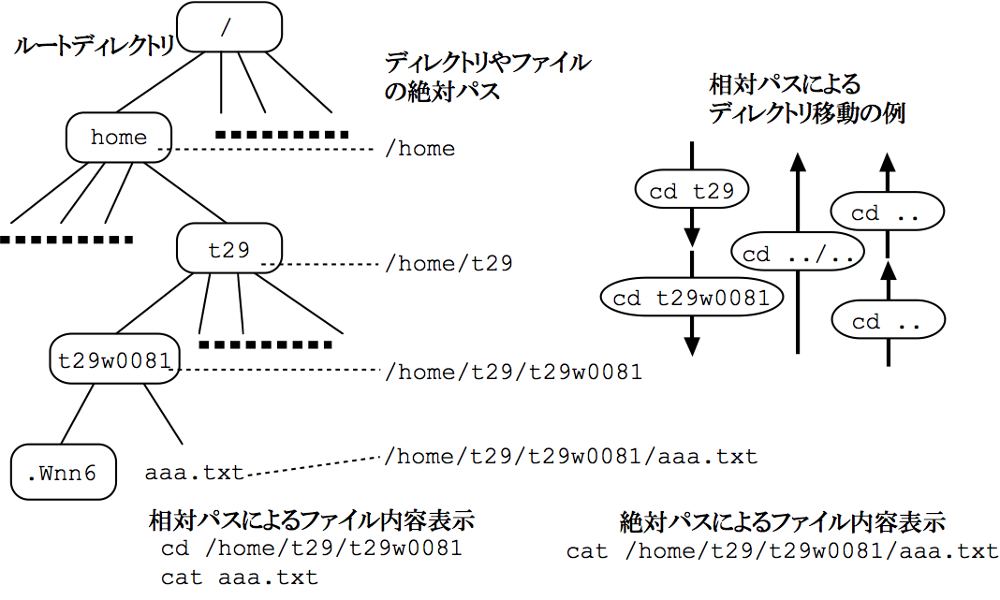

===================================
ファイルシステム・オンラインマニュアル
===================================

実習の手順
===================================

#. UNIXにおけるファイルシステムの理解
#. ファイルを扱う簡単なUNIXコマンドの利用
#. オンラインマニュアルの利用

実習の内容
===================================

解説を参考にしながら実習を進めて下さい。
(注意：ディスプレイの表示が、本テキストの表示と正確には一致していない
場合がある．本テキストの表示は一例であることに留意すること。)

.. _file-system:

ファイルシステム
-----------------------------------

解説の
図\ref{fig:file-system}を見て下さい。
ファイルシステムは図のような木構造をしています。
今ファイルシステムのどこにいるのか調べてみます。::

  pc0486:~ % pwd                              ---> カレントディレクトリの表示
    /home/ecsfs1/ecs/a00XX/a00XXYYY

ホームディレクトリもファイルの一つです。
どんなファイルがあるか見てみましょう。::

  pc0486:~% ls                                ---> ファイルのリスト
  ns_imap/  nsmail/  tmp/
  pc0486:~% ls -l
  合計 8
  drwxr-xr-x    3 a0010985 user           96 Apr 10  2002 ns_imap/
  drwx------    2 a0010985 user         8192 Apr 10  2002 nsmail/
  drwxr-xr-x    2 a0010985 user           96 Mar  5 17:34 tmp/

``-l`` をつけると，
ファイルの詳細情報が表示されます [#f3_1]_ 。

では，ルートディレクトリにはどんなファイルがあるのでしょう。::

  pc0486:~% ls /                             ---> ルートディレクトリのリスト表示
  admin/  boot/  etc/   kyoto/  lost+found/  mnt/  patch/  root/  site/   tmp/  var/
  bin/    dev/   home/  lib/    misc/        opt/  proc/   sbin/  staff/  usr/

ディレクトリには後ろに / ，実行ファイルには * がつきます。
[#f3_2]_ 表示の設定により，これらの記号がつかない場合もあります。

先頭が "." であるファイルも表示 ``-a`` してみましょう。
以下の例では、ファイルの詳細情報 ``-l`` も使っています。::

  pc0486:~% ls -al          ---> ./ はカレントディレクトリ，../ は親ディレクトリ
  合計 232
  drwxr-xr-x    8 a0010985 user         8192 Mar  5 17:41 ./
  drwxr-xr-x    5 root     sys            96 Jan 15  2002 ../
  -rw-------    1 a0010985 user          800 Mar  5 17:39 .Xauthority
  -rw-r--r--    1 a0010985 user         2953 Mar 25  2002 .Xdefaults
  -rw-r--r--    1 a0010985 user           24 Mar 25  2002 .bash_logout
  -rw-r--r--    1 a0010985 user          239 Mar 25  2002 .bash_profile
  -rw-r--r--    1 a0010985 user          641 Mar 25  2002 .bashrc
  -rw-r--r--    1 a0010985 user         5509 Mar 25  2002 .canna
  -rw-r--r--    1 a0010985 user          852 Mar 25  2002 .cshrc
  -rw-r--r--    1 a0010985 user          234 Mar 25  2002 .emacs
  -rw-r--r--    1 a0010985 user         6648 Mar 25  2002 .emacs-color.el
  -rw-r--r--    1 a0010985 user        16528 Mar 25  2002 .emacs.el
  -rw-r--r--    1 a0010985 user         7682 Mar 25  2002 .emacs19.el
  -rw-r--r--    1 a0010985 user        16563 Mar 25  2002 .emacs20.el
  -rw-r--r--    1 a0010985 user        15480 Mar 25  2002 .fvwm2rc
  -rw-------    1 a0010985 user            0 Mar  5 17:37 .history
  -rw-r--r--    1 a0010985 user          233 Mar 25  2002 .kkcrc
  -rw-r--r--    1 a0010985 user          170 Feb 27 15:21 .login
  drwxr-xr-x    5 a0010985 user         8192 Mar  5 17:29 .netscape/
  -rw-------    1 a0010985 user            0 Mar  5 17:19 .newsrc-news
  -rw-r--r--    1 a0010985 user         3511 Mar 25  2002 .screenrc
  drwx------    2 a0010985 user           96 Feb 27 16:31 .ssh/
  -rw-r--r--    1 a0010985 user         3511 Mar 25  2002 .twmrc
  drwxr-xr-x    3 a0010985 user           96 Apr 10  2002 .vine/
  -rw-r--r--    1 a0010985 user        13359 Mar 25  2002 .xemacs.el
  -rwxr-xr-x    1 a0010985 user          748 Mar 25  2002 .xinitrc*
  -rw-r--r--    1 a0010985 user          308 Feb 27 14:40 .xwm.msgs
  drwxr-xr-x    3 a0010985 user           96 Apr 10  2002 ns_imap/
  drwx------    2 a0010985 user         8192 Apr 10  2002 nsmail/
  drwxr-xr-x    2 a0010985 user           96 Mar  5 17:40 tmp/

.. [#f3_1] 詳細情報の意味については解説を見て下さい。
.. [#f3_2] テキストはいわゆるドキュメントファイルです。実行ファイルは、このファイル名をコマンドラインに入力すれば、何かの仕事をするファイルです。バイナリ形式であったり、スクリプトであったりします。バイナリファイルはエディタでは見られません。これを直接プリンタに出力するとトラブルになるので注意が必要です。

.. _file-command:

ファイルを扱うコマンド
-----------------------------------

シェルのリダイレクション(\ref{sec:red}参照)という機能を使ってファイルを
作ってみましょう。::

  pc0486:~% ls -l > list.txt         ---> リストの内容をlist.txt というファイルに保存する
  pc0486:~% ls -l
  合計 16
  -rw-r--r--    1 a0010985 user          258 Mar  5 17:47 list.txt     ---> できている
  drwxr-xr-x    3 a0010985 user           96 Apr 10  2002 ns_imap/
  drwx------    2 a0010985 user         8192 Apr 10  2002 nsmail/
  drwxr-xr-x    2 a0010985 user           96 Mar  5 17:41 tmp/

``cat`` コマンドでファイルの内容を表示します。::

  pc0486:~% cat list.txt                    ---> ファイルの内容を表示する
  合計 8
  -rw-r--r--    1 a0010985 user            0 Mar  5 17:47 list.txt
  drwxr-xr-x    3 a0010985 user           96 Apr 10  2002 ns_imap/
  drwx------    2 a0010985 user         8192 Apr 10  2002 nsmail/
  drwxr-xr-x    2 a0010985 user           96 Mar  5 17:41 tmp/

カレンダーを表示する ``cal`` コマンドのオンラインマニュアルの内容を，
cal_man.txt というファイルにセーブしてみましょう。::

  pc0486:~% man cal > cal_man.txt     ---> cal コマンドの manual をcal_man.txt に保存
  pc0486:~% ls -l
  合計 24
  -rw-r--r--    1 a0010985 user         1499 Mar  5 17:48 cal_man.txt  ---> できている
  -rw-r--r--    1 a0010985 user          258 Mar  5 17:47 list.txt
  drwxr-xr-x    3 a0010985 user           96 Apr 10  2002 ns_imap/
  drwx------    2 a0010985 user         8192 Apr 10  2002 nsmail/
  drwxr-xr-x    2 a0010985 user           96 Mar  5 17:41 tmp/

新たに text というディレクトリを作り，ディレクトリ間を移動してみます。::

  pc0486:~% mkdir text                 ---> text というディレクトリを作る
  pc0486:~% ls
  cal_man.txt  list  ns_imap/  nsmail/  text/  tmp/
  pc0486:~% pwd
   /home/ecsfs1/ecs/a00XX/a00XXYYY
  pc0486:~% cd text                    ---> 別のディレクトリへの移動
  pc0486:~/text% pwd
   /home/ecsfs1/ecs/a00XX/a00XXYYY/text
  pc0486:~/text% cd                    ---> ホームディレクトリに戻る
  pc0486:~% pwd
   /home/ecsfs1/ecs/a00XX/a00XXYYY

ファイルのディレクトリ間の移動，ファイル名の変更，コピーを行います。::

  pc0486:~% cp cal_man.txt text/           ---> cal_man.txtをディレクトリtextの下にコピーする
  pc0486:~% ls text/
  cal_man.txt
  pc0486:~% ls
  cal_man.txt  list  ns_imap/  nsmail/  text/  tmp/
  pc0486:~% mv list.txt filelist.txt           ---> ファイル名の変更
  pc0486:~% ls
  cal_man.txt  filelist  ns_imap/  nsmail/  text/  tmp/
  pc0486:~% mv filelist.txt text/          ---> ファイルの移動
  pc0486:~% ls
  cal_man.txt  ns_imap/  nsmail/  text/  tmp/
  pc0486:~% cd text/
  pc0486:~/text% ls
  cal_man.txt  filelist
  pc0486:~/text% cd                    ---> ホームディレクトリに戻る

ホームディレクトリに戻って，ディレクトリ *text* や
ファイルを消してみましょう。::

  pc0486:~% rm text          ---> rm はファイルの消去コマンド，ディレクトリは消せません
  rm: `text' はディレクトリです
  pc0486:~% rmdir text
  rmdir: text: ディレクトリは空ではありません
  pc0486:~% rm -r text         ---> -r をつけると中のファイルごとディレクトリが消せます
  rm: ディレクトリ ``text'' を下りていきますか(y/n)? y   ---> 本当に消すかどうか聞いて
                                                              きますので y と答えます
  rm: `text/cal_man.txt' を削除しますか(yes/no)? y
  rm: `text/filelist.txt' を削除しますか(yes/no)? y
  rm: ディレクトリ `text' を削除しますか[yes/no]? y
  pc0486:~% ls
  cal_man.txt  ns_imap/  nsmail/  tmp/
  pc0486:~% rm cal_man.txt
  rm: `cal_man.txt' を削除しますか(yes/no)? y
  pc0486:~% ls
  ns_imap/  nsmail/  tmp/

.. _manual:

オンラインマニュアル
-----------------------------------

オンラインマニュアルを利用してみましょう。
オンラインマニュアル ``man`` のマニュアルは、::

  pc0486:~ % man man

とすれば，次のように表示されます。::

  MAN(1)               Manual pager utils                      MAN(1)

  名前
         man - オンラインリファレンスマニュアルのインターフェース

  書式
         man  [-c|-w|-tZT  device]  [-adhu7V]  [-m  system[,...]]  [-L locale]
          [-p string] [-M path] [-P pager] [-r prompt] [-S list] [-e extension]
          [[section] page ...] ...
         man -l [-7] [-tZT device] [-p string] [-P pager] [-r prompt] file ...
         man -k [apropos options] regexp ...
         man -f [whatis options] page ...

  説明
         man はシステムのマニュアルページャーである。 man に与えられる引き
         数 page は、通常はプログラムやユーティリティ、関数などの名前である。
         これらの引き数それぞれに対応する  マニュアルページ が検索・表示され
         る。 section が指定されると、 man  はマニュアルを検索する対象をその
         セクションに限定する。  デフォルトの動作では、すべてのセクションを既
         定の順序で検索し、 最初に見つかった page だけを表示する。複数のセク
         ションに同名の  page   がある場合でも、表示されるのは最初の一つだけと
         なる。

         以下の表にマニュアルの section 番号と、それぞれに含まれるページの種
         類を示す。

         1   実行プログラムまたはシェルのコマンド
         2   システムコール (カーネルが提供する関数)
         3   ライブラリコール (システムライブラリに含まれる関数)
         4   スペシャルファイル (通常 /dev に置かれている)
         5   ファイルのフォーマットとその約束事。例えば /etc/passwd など
         6   ゲーム
         7   マクロのパッケージとその約束事。例えば man(7), groff(7) など
         8   システム管理用のコマンド (通常は root 専用)
         9   カーネルルーチン [非標準]

         マニュアルページは、いくつかの章からなる。

         それぞれには以下のような名前がついている。 名前 (NAME), 書式 (SYNOP
         SIS), 説明 (DESCRIPTION), オプション (OPTION), ファイル (FILES), 関連
         項目 (SEE ALSO), バグ (BUGS), 著者 (AUTHOR)

         書式の章では以下のような形式が用いられている。 他の章でも同様のルール
         を用いることができる。

         ボールド体 (bold)       そのままタイプする。
         イタリック体 (italic)   適切な引き数に置き代える。
         [-abc]                  [ ] 内部の引き数はすべて省略できる。
         -a|-b                    | で区切られたオプションは同時には指定できない。
   Manual page man(1) line 1

``Space`` で頁を進めます。
``q`` で途中で終了します。

同様にしてその他のコマンドのマニュアルを見て下さい。
例えば、 ``ls`` コマンドのマニュアルを見る場合は ``man ls`` です。

解説
===================================

.. _filesystem:

ファイルシステム
-----------------------------------

一般に **ファイル** とはハードディスク，フロッピーディスク，テープ，
CD-ROMなどの外部記憶装置(計算機のメモリー外)に情報を書きこむための1つの
単位です。
各ファイルには識別するためにファイル名が付けられ，後にファイルに書かれた
情報が必要になれば，ファイル名を指定して取り出します。
このファイル名は利用者がファイルを作成する時に自分で決めます。
この時，
ファイル名にどのような文字列で名前をつけることも許されています [#f3_3]_ 。
ただし，本演習では絶対に **ファイル名に日本語は使用しない** でください。

また，UNIXでは **ディレクトリ** という特別なファイルに
ファイル名を登録することによってファイルを管理しています。
このディレクトリを用いればファイルを
用途や分野別にまとめて管理することができます。
すなわち，ファイルを書類，ノートに例えた場合，
ディレクトリは整理箱，
ファイルキャビネットに当たります。
このディレクトリもユーザの必要に応じて作ることができ，
ディレクトリ中にはファイルと同じように
ディレクトリも登録することができます。
従って，ディレクトリ中にディレクトリをどんどん作っていくと
ファイルシステム全体では **木(階層化ディレクトリ)構造** となります [#f3_4]_ 。
この様子を図\ref{fig:file-system}に示します

   **図3.1**: ファイルシステム

また，あるディレクトリ内に作成され，
管理されているディレクトリやファイルからみて
管理しているディレクトリを「親」と呼びます。
一方，管理されているディレクトリやファイルは，
管理しているディレクトリからみて「子」と呼びます。
すべてのディレクトリ，
ファイルの親(ルートディレクトリ)は''/''で表します。

.. [#f3_3] /以外，アルファベット大文字，小文字，数字，記号，空白，日本語など。ただし，その長さは255文字までです。大文字小文字は区別されます。記号は+,-,_,$などが使えます。これら以外はシェルがある特別な意味に解釈することがあるので使わない方が良いでしょう。
.. [#f3_4] UNIXではディレクトリにそれぞれファイル名とi-ノード番号と呼ばれる内部番号をセットにして保存し，UNIXのカーネルはi-ノードによってファイルを一元管理し，人間はファイル名で識別しています。

ファイルサーバ
-----------------------------------
教育用コンピュータシステムでは，
管理サーバが全てのクライアントに対して，一つのファイルシステムを管理して
います。
このためどのクライアントからログインしても同一の環境で使うことができます。

ファイル名の指定
-----------------------------------
実際に特定のファイルを扱う時に使うファイル名は，
2種類の方法で指定することができます。

#. **絶対指定(絶対パス名)**

  ルートディレクトリから順次指定する方法で，
  親ディレクトリと子のディレクトリ，ファイルの区切りには''/''を用います。
  従って，絶対指定のファイル名は必ず''/''で始まりますが，
  ルートディレクトリと次のディレクトリの区切りには''/''は必要ありません。
  すなわち，//usrとはならないことに注意してください。

  **例**
    ::

      /home/ecsfs1/ecs/a00XX/a00XXYYY/list.txt
      /home/ecsfs1/ecs/a00XX/a00XXYYY/text/cal_man.txt

#. **相対指定(相対パス名)**

  UNIXでは，ユーザが login するとホームディレクトリと言う場所に
  作業ディレクトリが設定されます。
  皆さんの場合は，::

    /home/ecsfs1/ecs/a00XX/a00XXYYY

  が **ホームディレクトリ** となります。
  (XXYYYのところには皆さんの ECS ID番号が入ります。)
  この下にファイルを作ることになります。
  ホームディレクトリを''~''で表すこともできます。
  相対指定では，
  現在の作業ディレクトリ(カレントディレクトリ)
  からの相対的な位置でファイルを指定します。
  また，相対指定ではそのディレクトリの親を''..''で，
  自分自身(現在の作業ディレクトリ)を''.''で表します。
  この時のディレクトリ，ファイルの区切りは絶対指定と同じ''/''です。

  **例**
    カレントディレクトリが::

      /home/ecsfs1/ecs/a00XX/a00XXYYY

    であるとき，相対パス::

      \verb+./text/cal_man.txt

    は絶対パス::

      /home/ecsfs1/ecs/a00XX/a00XXYYY/list.txt

    と同じファイルを指します。  カレントディレクトリが::

      /home/ecsfs1/ecs/a00XX/a00XXYYY/text

    であるとき，相対パス::

      ../list.txt

    は  絶対パス::

      /home/ecsfs1/ecs/a00XX/a00XXYYY/list.txt

    と同じファイルを指します。

ファイルを扱う簡単なコマンド
-----------------------------------

**pwd** (Print Working Directory)

  UNIXで何らかの作業をする場合，
  その作業を行なうのに適したディレクトリに
  作業ディレクトリ(カレントディレクトリ)を移動します。
  しかし，相対指定でカレントディレクトリを移動する時には
  現在のカレントディレクトリを知っていることが必要な場合もあります。
  この時，カレントディレクトリの位置を教えてくれるコマンドが ``pwd`` です。::

    pc0486:~ % pwd
    /home/ecsfs1/ecs/a00XX/a00XXYYY

**ls** (LiSt)

  指定したディレクトリが管理する
  ファイルやディレクトリを表示するコマンドが ``ls`` です。
  ディレクトリを指定しなければカレントディレクトリの内容が表示されます。::

    pc0486:~% ls
    ns_imap/  nsmail/  tmp/
    pc0486:~% ls /                             ---> ルートディレクトリのリスト表示
    admin/  boot/  etc/   kyoto/  lost+found/  mnt/  patch/  root/  site/   tmp/  var/
    bin/    dev/   home/  lib/    misc/        opt/  proc/   sbin/  staff/  usr/

  この ``ls`` には種々のオプション [#f3_5]_ があります。
  例えば、
  オプション``\verb+-F+''はファイルとディレクトリを区別して表示することを
  指示します。
  ディレクトリの後ろには``\verb|/|''がつきます。
  実行ファイルの後ろには``\verb|*|''がつきます。
  また、
  オプション``\verb+-l+''はファイルとディレクトリの詳細な情報を表示することを
  指示します [#f3_6]_ 。

  ``ls -l`` で表示される
  ファイルとディレクトリの詳細な情報の最初の項目(1--aで示す10文字分)は，
  ファイルの属性を示します。::

    drwxr-xr-x    2 a0010985 user           96 Mar  5 17:40 tmp/

  123456789a(上の例ではそれぞれdrwxr-xr-x)の位置の表示の意味は
  次の表の様な内容をシンボルで表したものとなっています。

\begin{center}
\begin{tabular}[t]{|c|l|}\hline
項 & \multicolumn{1}{|c|}{{内\hspace{2cm}容}} \\\hline
1  & \parbox{6cm}{
\rule{0em}{1.2zw}ファイルの属性を示す項

    \begin{tabular}[t]{c@{\,:\ }l}
\verb+-+ & 普通のファイル\\
\verb|d| & ディレクトリファイル\\
\verb|l| & シンボリックリンク\\
\verb|c| & 文字型特殊ファイル\\
\verb|b| & ブロック型特殊ファイル\\
\verb|s| & ソケット\\
\verb|p| & 名前付パイプ
    \end{tabular}}\\\hline
2--4& 所有者に対するアクセス方法
\footnotemark\\\hline
5--7& グループに対するアクセス方法\footnotemark\\\hline
8--a& その他に対するアクセス方法\footnotemark\\\hline
\end{tabular}
\begin{tabular}[t]{|c|l|}\hline
項 & \multicolumn{1}{|c|}{{内\hspace*{2cm}容}} \\\hline
%
2,5,8 &\parbox{6cm}{
\rule{0em}{1.2zw}ファイルの読み出し

    \begin{tabular}[t]{c@{\,:\ }l}
     \verb+-+& 読み出し不許可\\
     \verb|r|& 読み出し許可\\
    \end{tabular}}\\\hline
3,6,9 &\parbox{6cm}{
\rule{0em}{1.2zw}ファイルの書き込み

    \begin{tabular}[t]{c@{\,:\ }l}
     \verb+-+& 書き込み不許可\\
     \verb|w|& 書き込み許可\\
    \end{tabular}}\\\hline
4,7,a &\parbox{7cm}{
\rule{0em}{1.2zw}ファイルの実行
(ディレクトリの場合は検索)

    \begin{tabular}[t]{c@{\,:\ }l}
     \verb+-+& 実行(検索)不可\\
     \verb|x|& 実行(検索)許可\\
    \end{tabular}}\\\hline
\end{tabular}
\end{center}
\addtocounter{footnote}{-2}
\footnotetext{
所有者とはそのファイルを作成した計算機利用者を指します。
この例の場合には \verb+a0010985+ です。
}
\addtocounter{footnote}{1}
\footnotetext{
UNIXではグループと言う
計算機利用者の集合を作ることが出来ます。
この例の場合 \verb+user+ です。
グループに対するファイルのアクセス権は，
所有者が属するグループに対して与えられるものです。}
%
\addtocounter{footnote}{1}
\footnotetext{
所有者にもグループにも属さない
一般計算機利用者に対するアクセス権を指します。}

  項目の2番目はリンク数，以下順次
  所有者，グループ，大きさ(Kバイト単位)，最終更新時刻，名前となっています。

  UNIXは，マルチユーザシステムですから，
  ファイル・ディレクトリは，
  その所有者の他の利用者から保護されなければなりません。

  各々のファイル・ディレクトリは，

\begin{center}
\begin{tabular}{l|l}
レベル & 記号 \\ \hline
所有者本人 & u \\
指定したグループ & g \\
その他の所有者 & o \\ \hline
\end{tabular}
\end{center}

  の各レベルに対して，
  それぞれ，
  read( **r** ), write( **w ** ), execute( **e** )
  の許可が設定されます。
  許可は **+** ，禁止は **-** で指定します。

  *verb|list.txt* というファイルの保護モードを変えてみましょう。::

    pc0486:~% ls -l
    合計 16
    -rw-r--r--    1 a0010985 user          258 Mar  5 18:01 list.txt
    drwxr-xr-x    3 a0010985 user           96 Apr 10  2002 ns_imap/
    drwx------    2 a0010985 user         8192 Apr 10  2002 nsmail/
    drwxr-xr-x    2 a0010985 user           96 Mar  5 17:41 tmp/

  *list.txt* の読み出し許可はすべての利用者に与えられていますが，
  書き込み許可は，所有者にのみ与えられています。
  これを，本人以外は読み出しも禁止にします。::

    pc0486:~% chmod go-r  list.txt   <---groupとotherの読み出しを禁止(-)する。
    pc0486:~% ls -l
    合計 16
    -rw-------    1 a0010985 user          258 Mar  5 18:01  list.txt   <---属性が変わった。
    drwxr-xr-x    3 a0010985 user           96 Apr 10  2002 ns_imap/
    drwx------    2 a0010985 user         8192 Apr 10  2002 nsmail/
    drwxr-xr-x    2 a0010985 user           96 Mar  5 17:41 tmp/

  次はグループ内利用者には，
  読み書き許可を与えます。::

    pc0486:~% chmod g+rw  list.txt   <---groupの読み出し書き込みを許可(+)する。
    pc0486:~% ls -l
    合計 16
    -rw-rw----    1 a0010985 user          258 Mar  5 18:01  list.txt  <---変わっている!!
    drwxr-xr-x    3 a0010985 user           96 Apr 10  2002 ns_imap/
    drwx------    2 a0010985 user         8192 Apr 10  2002 nsmail/
    drwxr-xr-x    2 a0010985 user           96 Mar  5 17:41 tmp/

  シェルスクリプト(\ref{sec:script}参照)
  を書いた時に，そのファイルを実行ファイルに変更する時にも使います。

**mkdir** (MaKe DIRectory)

  カレントディレクトリに，指定した名前のディレクトリを作成する。::

    pc0486:~% ls
     list.txt  ns_imap/  nsmail/  tmp/
    pc0486:~% mkdir text
    pc0486:~% ls
     list.txt  ns_imap/  nsmail/  text/  tmp/

**cd** (Change Directory)
  指定した名前のディレクトリにカレントディレクトリを変更する。::

    pc0486:~% pwd                        <---現在いるディレクトリは...
    /home/ecsfs1/ecs/a00XX/a00XXYYY
    pc0486:~% cd text                    <---textディレクトリに移動
    pc0486:~/text% pwd                   <---現在いるディレクトリを見ると...
    /home/ecsfs1/ecs/a00XX/a00XXYYY/text   <---変わっている!!

**mv** (MoVe files or directories)
  指定したファイルまたはディレクトリを移動または改名する。::

    pc0486:~% ls
    cal_man.txt  list.txt  ns_imap/  nsmail/  text/  tmp/
    pc0486:~% mv list.txt filelist.txt           ---> ファイル名の変更
    pc0486:~% ls
    cal_man.txt  filelist.txt  ns_imap/  nsmail/  text/  tmp/
    pc0486:~% mv filelist.txt text/          ---> ファイルの移動
    pc0486:~% ls
    cal_man.txt  ns_imap/  nsmail/  text/  tmp/
    pc0486:~% cd text/
    pc0486:~/text% ls
    cal_man.txt  filelist.txt                    <---filelistがある

**cp** (CoPy files or directories)

  指定したファイルまたはディレクトリを複写する。::

    pc0486:~% ls
    cal_man.txt  ns_imap/  nsmail/  text/  tmp/
    pc0486:~% cp cal_man.txt cal.txt
    pc0486:~% ls
    cal_man.txt  cal.txt  ns_imap/  nsmail/  text/  tmp/
    pc0486:~% cp -r text doc
    pc0486:~% ls
    cal_man.txt  cal.txt  doc/  ns_imap/  nsmail/  text/  tmp/
    pc0486:~% ls doc/
    filelist.txt
    pc0486:~% ls text/
    filelist.txt

**rm** (ReMove files or directories)

  指定したファイルまたはディレクトリを消去する [#f3_10]_ 。::

    pc0486:~% pwd
    /home/ecsfs1/ecs/a00XX/a00XXYYY
    pc0486:~% ls
    cal_man.txt  cal.txt  doc/  ns_imap/  nsmail/  text/  tmp/
    pc0486:~% rm cal.txt
    rm: `cal.txt' を削除しますか(yes/no)? y
    pc0486:~% ls
    cal_man.txt  doc/  ns_imap/  nsmail/  text/  tmp/
    pc0486:~% rm test
    rm: ``test'' を削除できません: そのようなファイルやディレクトリはありません
    pc0486:~% rm text
    rm: `text' はディレクトリです
    pc0486:~% rm -r text
    rm: ディレクトリ ``text'' を下りていきますか(y/n)? y
    rm: `text/filelist' を削除しますか(yes/no)? y
    rm: ディレクトリ `text' を削除しますか[yes/no]? y
    pc0486:~% ls
    cal_man.txt  doc/  ns_imap/  nsmail/  tmp/

**cat** (conCATenate files)
  指定した複数ファイルの内容を連結(concatenate)して標準出力に出力する。::

    pc0486:~% ls
    cal_man.txt  list  ns_imap/  nsmail/  text/  tmp/
    pc0486:~% ls > list.txt
    pc0486:~% ls text/
    cal_man.txt  filelist
    pc0486:~% ls text/ > list_text.txt
    pc0486:~% cat list.txt list_text.txt   <----- 2つのファイルを指定します。
    cal_man.txt  list  ns_imap/  nsmail/  text/  tmp/
    cal_man.txt  filelist    <----- 2つのファイル内容が連結されて表示されます。

  ファイルをひとつだけ指定するとき，そのファイルの内容を見ることができます。::

    pc0486:~% cat list.txt
    cal_man.txt  list.txt  ns_imap/  nsmail/  text/  tmp/

  ファイルを指定しないとき，標準入力（例ではキーボード）から入力された内容を出力します。::

    pc0486:~% cat > sample.txt
                                <----- 入力待ち状態になります
    \end{verbatim}
    \end{shadebox}
    \end{center}

    \begin{center}
    \begin{shadebox}
    \begin{verbatim}
    pc0486:~% cat > sample.txt
    You are my sun shine        <----- 任意の文字列を書きこみます
    My only sun shine           <----- 複数行にわたってもかまいません
    \end{verbatim}
    書き終えたら \keytop{\verb|Ctrl|}を押しながら\keytop{\verb|D|}を押します。
    \begin{verbatim}
    pc0486:~% ls
    cal_man.txt  list.txt  sample.txt  <------ 新しいファイルができています
    ns_imap/  nsmail/  text/  tmp/
    pc0486:~% cat sample.txt    <------ 単一ファイルの中身を見ます
    You are my sun shine
    My only sun shine

.. [#f3_5] コマンドの動作を制御するために，コマンドと空白で区切った特定の文字をコマンドに付加することをコマンドにオプションを与えると言います。UNIXでは殆んどのコマンドにオプションがあり，大抵の場合オプションは''-''の文字で始まります。
.. [#f3_6] オプションは組み合わせて用いることも出来ます。例えば， ``ls`` のオプション ``-F`` と ``-a`` を同時に付加したい場合は  ``ls -Fa`` で実現できます。なお、本演習の環境では、エイリアス機能を利用して、 ``ls`` には、すでにオプション ``-F`` が与えられています．
.. [#f3_10] UNIX では一般に削除したファイルは絶対に復活できません。`` rm * `` や ``rm .`` は気をつけて下さい。

ファイルの作成
-----------------------------------

内容が文字列(アルファベット，数字，記号，日本語)である
ファイルの作成，編集にはエディタを用います。
UNIXには種々のエディタが存在しますが，
この演習ではemacs というスクリーンエディタを用います。
これについては別の章で詳しく演習します。

.. _file-2:

広義のファイル
-----------------------------------

UNIX ではハードディスク，
CD-ROM などの記憶メディア，
メモリ，キーボード，
端末，ディスプレイ画面，
マウス
など各種デバイスを
普通のファイルと区別することなく扱うことができます。

プロセス間通信とファイルの読み書きとが
同じ操作でできます。
したがって，
あるファイルからデータを読み込んで加工し，
書き出すというプログラムは，
データの流れをパイプを使っていくつも連結し，
プロセス間通信をするプログラムとなります。
このようなプログラムをフィルタといいます。

例えばシェルから起動されるプログラムには，
標準入力，出力，エラー出力という特別な入出力の路が用意されていて，
それぞれ通常キーボード，画面，画面に割り当てられています。
しかし，UNIXでは，
キーボードも画面も一つのファイルとして扱うので，
これを別のファイルに置き換えることが簡単にできます。
これをリダイレクトといいます。
実習の例では，
画面に出るテキストを''>'' 記号を使って，
ファイルに書き出しています。
この機能についてはシェルの演習で詳しく述べます。

マニュアルの利用
-----------------------------------

UNIXシステムには非常に多くのコマンドがあります。
各コマンドが複雑なオプションを備えている場合も
多くあります。
また，プログラムを作成する場合には，
UNIXで用意されている関数を利用する必要があり，
これらのコマンド，関数などを利用するための説明書も用意されています。
こらの説明書は
``Reference manual''とか単に ``manual''と呼ばれ，
UNIX内部に保持されており，
画面に表示して読むことができます [#f3_11]_ 。
一方，このmanualを印刷して本の形式にしたものもありますが，
検索が面倒なことや手元に分厚い本を置きながらの利用が不便なことから
``オンラインマニュアル''の形で利用されるのが一般的です。
manualは通常英語で書かれていますが，
日本語に対応したUNIXでは日本語のマニュアルを利用することができます。
但し，全ての項目が日本語で書かれているとは限りません。

**man**
  manualを参照するには ``man`` コマンドを利用します。
  利用法は::

          man  項目名

  であり，指定した項目の説明が表示されます。
  この項目にはコマンド名，関数名などの参照したい名前を指定します。
  従って， ``man`` の利用方法を知りたい場合には::

    pc0486:~ % man man

  で， ``man`` の利用法が画面に表示されます。::

    MAN(1)               Manual pager utils                      MAN(1)

    名前
           man - オンラインリファレンスマニュアルのインターフェース

    書式
           man  [-c|-w|-tZT  device]  [-adhu7V]  [-m  system[,...]]  [-L locale]
            [-p string] [-M path] [-P pager] [-r prompt] [-S list] [-e extension]
            [[section] page ...] ...
           man -l [-7] [-tZT device] [-p string] [-P pager] [-r prompt] file ...
           man -k [apropos options] regexp ...
           man -f [whatis options] page ...

    説明
           man はシステムのマニュアルページャーである。 man に与えられる引き
           数 page は、通常はプログラムやユーティリティ、関数などの名前である。
           これらの引き数それぞれに対応する  マニュアルページ が検索・表示され
           る。 section が指定されると、 man  はマニュアルを検索する対象をその
           セクションに限定する。  デフォルトの動作では、すべてのセクションを既
           定の順序で検索し、 最初に見つかった page だけを表示する。複数のセク
           ションに同名の  page   がある場合でも、表示されるのは最初の一つだけと
           なる。

           以下の表にマニュアルの section 番号と、それぞれに含まれるページの種
           類を示す。

           1   実行プログラムまたはシェルのコマンド
           2   システムコール (カーネルが提供する関数)
           3   ライブラリコール (システムライブラリに含まれる関数)
           4   スペシャルファイル (通常 /dev に置かれている)
           5   ファイルのフォーマットとその約束事。例えば /etc/passwd など
           6   ゲーム
           7   マクロのパッケージとその約束事。例えば man(7), groff(7) など
           8   システム管理用のコマンド (通常は root 専用)
           9   カーネルルーチン [非標準]

           マニュアルページは、いくつかの章からなる。

           それぞれには以下のような名前がついている。 名前 (NAME), 書式 (SYNOP
           SIS), 説明 (DESCRIPTION), オプション (OPTION), ファイル (FILES), 関連
           項目 (SEE ALSO), バグ (BUGS), 著者 (AUTHOR)

           書式の章では以下のような形式が用いられている。 他の章でも同様のルール
           を用いることができる。

           ボールド体 (bold)       そのままタイプする。
           イタリック体 (italic)   適切な引き数に置き代える。
           [-abc]                  [ ] 内部の引き数はすべて省略できる。
           -a|-b                    | で区切られたオプションは同時には指定できない。
     Manual page man(1) line 1

  ここで ``Space`` を押すとさらに次の画面が表示されます [#f3_12]_ 。
  表示を終了する時は， ``q`` を押します。

  ここでマニュアルの構文の中の''[]'' で囲まれた部分は
  省略できることを示しています。

  ``man`` の ``-k`` というオプションは
  その引数として指定した文字列をキーワードとして含む
  マニュアルページを調べます。

.. [#f3_11] これを``オンラインマニュアル''といいます
.. [#f3_12] ``man`` では画面表示に **PAGER** として ``more`` や ``less`` を使っています。皆さんのデフォルトの **PAGER** は ``less`` になっています。

付録 (UNIXのコマンド2)
-----------------------------------

.. csv-table::
   :header: "コマンド名", "機能", "形式例"
   :widths: 15, 30, 30

   "cat", "ファイルを連結して表示", "cat file1 file2 .."
   "ls", "ディレクトリの内容の表示", "ls name"
   "cd", "作業ディレクトリを変更する", "cd dir"
   "mkdir", "ディレクトリの作成", "mkdir  dir"
   "rm", "ファイルまたはディレクトリの削除", "rm file .."
   "mkdir", "ディレクトリの削除", "rmdir dir .."
   "mv", "ファイルの移動または改名", "mv file1 file2, mv file... directory"
   "cp", "ファイルの複写", "cp file1 file2, cp -r dir1 dir2"
